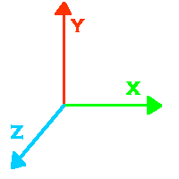

# Spin Spin Sugar

## Co-ordinate Systems & Axes

Off we go again then. All distances in VRML are measured in metres. This doesn't matter so much in your own world, as long as 
you're consistent, but if you want to link to other people's worlds or use external files, it's a good idea to keep to the standard.
The VRML co-ordinate system works as shown in the diagram below:

The X-Axis is horizontal, Y is vertical, and Z is coming <EM>out</EM> of the screen at you in the
diagram above.

Rotations in VRML work by the right-hand rule. If you imagine wrapping your hand around one of the axes, with your thumb pointing in the 
positive direction, the direction of positive rotation is the same as the direction that your fingers wrap around in, i.e. clockwise looking in a positive
direction. This is true for rotations about any axis, so if you want to rotate an object 90 degrees away from you around the X axis, you would use a 90 degree negative
rotation. This also applies to rotations about arbitrary axes, as explained later on in this tutorial. One other point to make is that
all rotations are measured in <STRONG>radians</STRONG> not degrees. So, to do the rotation described above, you would in fact do a rotation of -1.57 around the X axis.
Below is a quick reference for degrees to radians conversion. In general, multiply the number of degrees by <STRONG>pi/180</STRONG>.

<TABLE WIDTH=400><TR>
<TD><STRONG>Degrees</STRONG></TD><TD><STRONG>Radians</STRONG></TD>
</TR><TR>
<TD>0</TD><TD>0</TD>
</TR><TR>
<TD>45</TD><TD>0.78</TD>
</TR><TR>
<TD>90</TD><TD>1.57</TD>
</TR><TR>
<TD>135</TD><TD>2.36</TD>
</TR><TR>
<TD>180</TD><TD>3.14 (pi)</TD>
</TR><TR>
<TD>225</TD><TD>3.93</TD>
</TR><TR>
<TD>270</TD><TD>4.71</TD>
</TR><TR>
<TD>315</TD><TD>5.5</TD>
</TR><TR>
<TD>360</TD><TD>6.28 (2*pi)</TD>
</TR></TABLE>

## Transformations

Right. In order to make our world any use at all, we need to be able to <EM>transform</EM> objects. VRML has three types of transformations
we can apply to objects. These are <STRONG>translation</STRONG>s, <STRONG>rotation</STRONG>s, and <STRONG>scale</STRONG>s. These are used in a <STRONG>Transform</STRONG> node. A <STRONG>Transform</STRONG> node doesn't 
have to have all three in it. You can just have a rotation, for instance. The transformations within a <STRONG>Transform</STRONG> apply to
the <STRONG>children</STRONG> of the node. This is called <EM>nesting</EM>, where a node can have any number of child nodes. The syntax for this is
shown in the example below, along with the syntax for a <STRONG>Transform</STRONG> node.

<PRE>
Transform {
   translation 1 1 1
   rotation 0 1 0 0.78
   scale 2 1 2
   children [
      USE FBOX
   ]
}
</PRE>

A <STRONG>Transform</STRONG> node can have another nested inside it as a child, which allows you to do sequences of transformations. Remember, the order 
of transformations matters. A rotation followed by a translation is not the same as a translation followed by a rotation. Within a single <STRONG>Transform</STRONG> node, the
transformations are carried out in strict order: Scale, then Rotate, the Translate. So, if you want a translation followed by a rotation, you need to
nest <STRONG>Transform</STRONG> nodes inside one another.

Back to the plot, we need to describe how each type of transformation works.

## Translation and Scale

These two transforms are very similar. Both take three arguments; x y and z values. Translation moves the centre of the object 
these distances in the appropriate direction. Scale multiplies the size of the object by these values in the appropriate directions.
A translation of 0 in a direction will leave the object unaffected in that direction. A scale factor of 0 will make the object infinitely thin 
in that direction, which is not normally desirable. A scale factor of 1 is required for no effect.

It is very important to remember that scaling takes place relative to the <EM>origin</EM>, not the centre of the object. So, in order to 
scale from the centre of an object, you must make sure that the object is centred on the origin. This is why scaling is done first before any rotations or translations.

## Rotation

Rotation is slightly different from the two previous types. It takes four arguments. The first are three co-ordinates, which define the axis of rotation, and the last
is the angle to rotate by, in radians. So, to rotate 1 radian about the Y axis, for instance, you would write:

<PRE>
Transform {
   rotation 0 1 0 1
   children [
      USE FBOX
   ]
}
</PRE>
The length of the rotation axis can be anything, not necessarily 1. You could use a Y value of 50
if you liked, but it wouldn't do anything different to a Y value of 1. The axis of rotation is
completely arbitrary, you can rotate about any axis you like. For instance, an axis of 1 0.3 2.45 is
perfectly valid. It can be difficult to create rotations of this type, however. They can be
difficult to visualise, especially if you've had no practise. Because of this, Vapour Technology
have created a couple of tools called Dizzy and Twister to help you out. Twister creates axis-angle
rotation from a simpler type, and Dizzy joins up multiple axis-angle rotations to create a single
one with the same effect. You can use these to make it easier to rotate your objects around in the
world. They are available from Vapour Technology's home page, at
<A HREF="http://www.vapourtech.com/" TARGET=_top>http://www.vapourtech.com</A>.

## Spinning Down
That's about it for transformations and stuff. All that remains is to give an example. So, if we take our world from the previous tutorial
and add another box under the first, rotated 45 degrees about the Y axis,
and scaled by 2 in the X and Z directions, and by 0.5 in the Y, we get
this <A HREF="../source/tut13.html">code</A> for our world. 

You can see this world by clicking below: <A HREF="../worlds/tut13.wrl" TARGET=_new>Tutorial 1.3 World</A>

Right, that's the end of this tutorial. As you can see, we're starting to get a bit more
sophisticated now. Next, we get to play about with how the shapes look, by studying the
<STRONG>Appearance</STRONG> node in detail.
