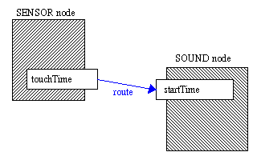

# Techy Stuff

OK. We're starting to get into the guts of VRML now. We've covered the basics, and got something going. Now, we
need to start getting serious about all this. This tutorial is going to go into the details of the types of
fields and events a node can have, and explain about Prototyping, which is useful for code reuse. Then, we'll 
cover routes, which are the basis for all animation in VRML. We're not really going to apply this stuff until
later, but it's useful to get it out of the way.

## Fields & Types

Right then. As you've probably picked up from the previous tutorials, VRML files consist of groups of nodes.
These nodes can also contain other nodes, and also can contain fields. Each field has a type, which governs 
what data it can contain, and how much of it. There are a number of different types in VRML, which are 
described below. You'd best get used to these, because I'm going to use them to describe the nodes from now on.

<dl>
<dt>**SFBool**
<dd>This is a single boolean value, which can take the value "TRUE" or "FALSE".
<dt>**SFColor & MFColor**
<dd>SFColor is a field containing a single colour, made up of three floating-point numbers between 0 and 1 
    corresponding to the red, green and blue values of that colour, e.g. 0 1 0 is green. MFColor is a field 
    containing multiple colours, e.g. [0 1 0, 1 0 0, 0 0 1].
<dt>**SFFloat & MFFloat**
<dd>SFFloat is a single floating-point value, e.g. 7.5. An MFFloat is a number of floating-point values, e.g. 
    [1.0, 3.4, 76.54].
<dt>**SFImage**
<dd>SFImage is a two-dimensional image, either in colour or grey. It consists of:
    
    * Two integers, representing the width and height of the image.
    * One integer representing the number of components in the image. 1 is grey levels only, 2 is greys with
        transparency, 3 is RGB colour, and 4 is RGB with transparency.
    * After these, there are *width * height* hexadecimal numbers, consisting of 2 digits for each
        component. So, 0xFF would be white in a 1-component image, and 0xFF00007F would be half-transparent
        red in a 4-component image.
    
    Pixels are specified from left to right, bottom to top.
<dt>**SFInt32 & MFInt32**
<dd>A single or list of 32-bit integer numbers. These can be in decimal or hexadecimal format. Hexadecimal 
    numbers start with 0x, e.g. 0xFF is 255 in decimal.
<dt>**SFNode & MFNode**
<dd>SFNode is a single node, and MFNode is a list of nodes. Note that the **children** field in many nodes
    is of type MFNode.
<dt>**SFRotation & MFRotation**
<dd>These fields specify a rotation about an axis. It is made up of four floating-point numbers. The first
    three specify X Y and Z coordinates for the vector corresponding to the axis about which to rotate, and
    the fourth is the number of radians to rotate by. Further explanation is in the **rotation** section 
    of <A HREF="tut13.html">tutorial 1.3</A>. SFRotation is a single set of values, MFRotation is a list.
<dt>**SFString & MFString**
<dd>This type contains a list of characters in the utf-8 character set. ASCII is a subset of utf-8, so you 
    needn't worry about different character sets or anything. A string (SFString) is specified as "Hello", in double
    quotes. A list (MFString) looks like this: ["Hello", "World"].
<dt>**SFTime & MFTime**
<dd>A single or list of times. Times are specified as floating-point numbers representing the number of seconds 
    elapsed since midnight on the 1st January 1970. This make more sense when we cover events later on.
<dt>**SFVec2f & MFVec2f**
<dd>A single or list of 2D vectors. A 2D vector is a pair of floating-point numbers.
<dt>**SFVec3f & MFVec3f**
<dd>A single or list of 3D vectors. A 3D vector is a triple of floating-point numbers. 
</dl>

Right, now that you know all the field types and how to specify them, we can go on to cover events. We're getting
to the stage now where you need some kind of detailed node reference. I'll hopefully produce one in time, but not
just at the moment. If you use Windows, get hold of Dr. Clue's VRML Helpfile. If not, you can use the VRML
specifications. Both are linked from the <A HREF="http://web3d.vapourtech.com/links.php">Links</A>
section. Also, check the VRML Repository for information.

## Events

Right then, events. As well as a number of fields, most nodes contain *events*. There are two types, **eventIn**
and **eventOut**. **eventOut**s are outgoing events, which generate information such as the changing of a value, 
or the time of a mouse click. **eventIn**s are incoming events, which accept information from outside the node and
do something with it. Each event has a data type associated with it, as described above.


Some nodes have fields that are *exposed*. This means that the node has two events defined for that field,
**set_fieldname** and **fieldname_changed**. These are an **eventIn** and **eventOut** for the field that
can be used to set its value and notify the outside world when it has been changed. If you use **set_fieldname** to
set the value of the field, the node then generates a **fieldname_changed** event.
For ease of use, the **set_** and **_changed** parts of the events can be left out, and the browser will work out
which event is being used. If a field is not exposed, it cannot be changed by events, and the value in the file is
the one used at all times. To see which fields are exposed in each node, get hold of a reference guide from one of 
the places on the <A HREF="http://web3d.vapourtech.com/links.php">links</A> page, or take a look
at the <A HREF="nodes.html">node reference</A> in the appendices to this
tutorial.

## Routes

In order to do useful things with events, we need to somehow wire them together. This wiring is known as a **ROUTE**.
For example, to route a **touchTime eventOut** to a **startTime eventIn** (for instance to play a sound on a mouse
click), we would route the event as follows:

```
ROUTE SENSOR.touchTime TO SOUND.startTime
```


So, this bit of code will route the **touchTime** event from a TouchSensor (covered later) to a **startTime** event
in a sound node (also covered later). Therefore, when the TouchSensor is clicked, the sound will play. You need to use 
DEF for each node that you route to or from, so that it has an individual name. So, the TouchSensor and Sound nodes would
be defined:
```
DEF SENSOR TouchSensor {
}

DEF SOUND Sound {
}
```

Except with fields inside them, obviously. If you have a number of objects with the same name (by using USE), and route to
or from them, all objects are affected, so if you just want one to be affected, give it a unique name or use a PROTO, as
explained below.

## PROTO

Just one more thing to cover, and that's prototyping. This isn't really related to events and routes, but now that I've
explained the fields, it's easier to explain.


Prototyping is a way of reusing your code. If you want a number of objects of the same type, you can use DEF and USE.
However, what if you want a number of objects that are very similar, but with slight differences, say different heights?
In that case, you can use PROTO instead. To define a prototype, you define your object, and define fields and events 
for it. Here is an example of a PROTO for a box with variable colour.

```
PROTO VBox [
   field SFColor boxColour 1 0 0
]
{
   Shape {
      appearance Appearance {
         material Material {
            diffuseColor IS boxColour
         }
      }
      geometry Box {
      }
   }
}
```

The field in square brackets at the start of the declaration is the interface for the object, and the numbers are the
default values for the field. When an instance of VBox is declared, the value assigned to the field boxColour is placed 
into the **diffuseColor** field of the **Material** node. Therefore, to declare a red VBox and a green VBox, we
can use the new VBox node anywhere we could use a **Shape** node previously, as the top-level node in the declaration
is a **Shape** node.
```
VBox { }

VBox {
   boxColour 0 1 0
}
```

The first use defines a default red VBox, the second gives a green one. You can define eventIns,
eventOuts and exposedFields for prototypes in the same way, using IS to map the PROTO field to a
field in the implementation. A PROTO field has to be mapped to the same type of field/event (you
can't map an eventIn to an eventOut), and also has to be the same data type (can't map an SFTime to
an SFFloat). The only exception to this is that you can map a normal field in the PROTO definition
to an exposedField in the implementation, as a normal field is, if you like, a subset of an
exposedField, so mapping the two together does no harm. You can't go the other way though...

## EXTERNPROTO

If you want to define PROTOs elsewhere than in your main file, you can use EXTERNPROTO. This just tells the browser that
the bulk of the object definition is in another file. In your main file, you include an EXTERNPROTO definition, and have
the full PROTO in the other file. The EXTERNPROTO syntax is shown below:

```
EXTERNPROTO VBox [
   field SFColor boxColour
]
"proto.wrl"
```

The file, "proto.wrl" in this case, must contain the VRML header and the prototype definitions, nothing else. If you
have more than one PROTO in the file, you must declare which one you are using like so: ```"proto.wrl#VBox"```
Note that you don't need to include the default values in the EXTERNPROTO definition, just the field
types. Instead of a single file, if you want to include mutiple options for the file to load you can
put them in square brackets like so:
```
EXTERNPROTO VBox [
   field SFColor boxColour
]
[
   "proto.wrl"
   "http://www.mydomain.com/protos/proto.wrl"
]
```
## Terminus

You can take a look at the world so far if you like. I've replaced the four cone definitions with a PROTO, 
so it all looks the same, but is more efficient, and is a slightly smaller file.
<BR><A HREF="../worlds/tut17.wrl" TARGET="_new">Tutorial 1.7 World</A>
+ <A HREF="../source/tut17.html">code</A>.


That's about that then. We'll use all this stuff from now on, with animation and scripting and so on. In the next couple
of tutorials however, I'm going to cover lighting, cameras, sound, and a few other fancy effects to make your worlds more
realistic and useful.
