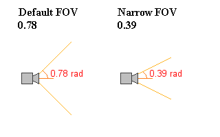

# I Can See My House From Here!

In the second part of this tutorial, I'm going to cover how you can make your scenes look more realistic. 
This covers cameras, lights, sound, backgrounds, and all manner of other things. The first thing, though, is
to do away with the default start point and have a look at cameras.

VRML browsers create a default entry point for a scene, which is normally along the +Z axis,
at a distance so that the whole of the world is displayed in the window. However, you might not want to start
from this position, or you might want the viewer to be able to select one of a number of viewpoints. To do
this, you place extra cameras into your scene using the <STRONG>Viewpoint</STRONG> node.

The viewpoint node has a number of fields. The first is a the <STRONG>position</STRONG> field, which is a <STRONG>SFVec3f</STRONG>
(i.e. a triple of floating-point values representing X, Y and Z positions). This defines the position of the camera in
the world. The next is <STRONG>orientation</STRONG> field, which is a SFRotation. This has three floating-point numbers defining the
rotation of the camera, in the same way as a normal rotation. The default <STRONG>orientation</STRONG> is looking in the 
-Z direction with +X to the right and +Y above.

The next field is <STRONG>fieldOfView</STRONG>. This is a floating-point number in radians between 0 and pi, defining the angle of the
field of view. This is shown in the diagram below. Smaller values correspond to a narrower field of view, giving a
telephoto effect, while larger angles give a wide-angle lens effect. The default is 0.78 radians, giving a normal field
of view.

A <STRONG>Viewpoint</STRONG> also has a <STRONG>description</STRONG> field, which the browser can use to display a description of the camera.
This is an <STRONG>SFString</STRONG> field. The full syntax for a <STRONG>Viewpoint</STRONG> looks like so:

<PRE>
Viewpoint {
   position 0 5 5
   orientation 1 0 0 0.39
   fieldOfView 0.39
   description "Camera 1"
}
</PRE>

This defines a camera at 0 5 5 looking slightly down at 22.5 degrees, with a narrow FOV, and a description "Camera 1"

You can use different cameras to create different entrances to your scene. By specifying the camera name in the link to the
page, that camera is used at the entry to the scene. For instance, to enter a scene at a camera called "CAM1" you would link
to the file like this:

<PRE>
world.wrl#CAM1
</PRE>

This assumes the camera has been DEFed to be called CAM1. The description is used in the browser, but this method uses
the name specified in DEF.

## Out of Film

The browser will start viewing your world at the first camera it finds in the file, so make sure that the default entry point is
the first one you write in. Another little thing, Viewpint planning can be a bit awkward, If you
know where your camera is, and where you want to look at, it can be difficult to work out the
correct orientation. However, there is a little tool from <A HREF="http://www.vapourtech.com"
TARGET="_top">Vapour Technology</A> which does all this for you, called <A
HREF="http://www.vapourtech.com/dev/vrmltools.php#Peek" TARGET=_top>Peek</A>. You might find
it useful while doing this sort of thing.

That's all for cameras, nice and simple. You can check out my world with three cameras in by clicking on one of the links below. You <EM>should</EM> be 
taken to different entry points depending on which you click.
 <A HREF="../worlds/tut21.wrl#norm" TARGET=_new>Normal View</A>
 <A HREF="../worlds/tut21.wrl#aerial" TARGET=_new>Aerial View</A>
 <A HREF="../worlds/tut21.wrl#headcam" TARGET=_new>HeadCam View</A>
 <A HREF="../source/tut21.html">Code</A>
