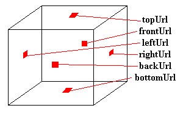

# Over The Hills And Far Away...

## Background

So far, the worlds we have created look OK, but are lacking something in the way of distance. You have an object floating in space,
and that's it. OK for some things, but to look good, we need some kind of background. The default background is black, but that's 
not very nice. Lets do something about it.


There are two ways we can change the background of our scene. One is to specify colours for the background, and the other is to 
provide images to be mapped onto the background. Both of these are implemented with the **Background** node. First of all, 
I'll describe how to add colour to the background of your scene.


The **Background** node has a number of fields used for background
colours. These are:

```
Background {
   MFFloat     groundAngle       []
   MFColor     groundColor       []
   MFFloat     skyAngle          []
   MFColor     skyColor          [0 0 0]
}
```

Just a quick note about the format of the node definitions. Up until now,
I've been showing you examples of the nodes with value in place, which is
how you would actually use it. From now on, however, I'm going to give the
actual definition of the fields. This is the field name, the type, and the
default value. You still use the nodes in the same way (as shown in the
example a little further down), but I'm giving you a little more
information. If you've read the <A HREF="tut17.html">Techy Stuff</A>
tutorial, you'll understand what's going on.


Right, we can carry on now... The default values are shown above. The
default is a single **skyColor** of 0 0 0, black. **skyColor** is a
list of SFColor values, corresponding to the sequence of colours to be
displayed on the background, from the point directly above, downwards. So, the first
value is displayed above, and the next is displayed below that, and so on. **skyAngle** is the angle (down from the top) that each band of colour will
be displayed at. The first colour is automatically displayed at an angle of 0 (straight up), so you don't need to include that one. Therefore, there
will always be one fewer angles than colours. The browser interpolates between the colours on the background, so you get a 
smooth blending effect. For instance, the following code would give a mix between red (straight up), green (45 degrees up), and blue (straight ahead).

```
Background {
   skyColor [1 0 0, 0 1 0, 0 0 1]
   skyAngle [0.78, 1.57]
}
```

This will appear as shown in this <A HREF="../worlds/tut22a.wrl" TARGET="_new">example</A> and <A HREF="../source/tut22a.html">code</A>.


The **groundColor** and **groundAngle** have the same effect as above, but an angle of 0 corresponds to straight down, instead of straight up.
To have a single colour as background, simply specify a single **skyColor** and nothing else.
To get a sharp horizon, you need to use both **groundColor** and **skyColor**, otherwise if you
only use one, it interpolates between the colours.

## Panoramas

There is another way to provide a background for your world. This is to provide a number of textures to be mapped
onto a cube around the world. This cube is always centred on the viewer, so the viewer can never approach it, no matter how
far they move. This is done with six other fields in the **Background** node. These specify six urls of images
to be mapped onto the cube as shown below.

```
Background {
   MFString    backUrl           []
   MFString    bottomUrl         []
   MFString    frontUrl          []
   MFString    leftUrl           []
   MFString    rightUrl          []
   MFString    topUrl            []
}
```


If you specify images with transparency in them, the background colour specified with the fields previously
described will show through. Normally, if you don't have transparency, you shouldn't specify background
colours, as it will slow down the browser.

## Fog

If you want a fog effect, VRML can do that too! You simply have to include a **Fog** node in your file, and there you go!
Objects in the distance will then be obscured by the fog, and appear out of it as they approach. The syntax of a **Fog** node is as follows:

```
Fog {
   SFColor     color             1 1 1
   SFString    fogType           "LINEAR"
   SFFloat     visibilityRange   0
}
```

The **color** field specifies the color, so you can have fog, smog, smoke, or a red mist or something equally weird.
**type** is the type of fog, which governs how quickly objects fade into the fog. There are two options here: "LINEAR" and "EXPONENTIAL".
"LINEAR" gives a linear fade into the fog, and "EXPONENTIAL" give more exponential blending, giving a more natural fog
appearance. The final node is **visibilityRange**. Beyond this distance from the viewer, nothing is visible. Inside this range,
objects are partially obscured by fog. A **visibilityRange** of 0 means that the fog does not affect anything, whatever its distance.


**Fog** nodes are useful for optimisation, as well as fancy effects, as nothing beyond **visibilityRange** is rendered. If you have a **Fog**
node and a **Background** node, the background is unaffected by the fog, so shows through as normal. This could give some very
weird effects, so it's best if you do have both, to make the background the same colour as the fog. It still shows through, but you can't tell!


You can see the fog effect in this <A HREF="../worlds/tut22b.wrl" TARGET="_new">example</A>, with <A HREF="../source/tut22b.html">code</A>.

## Into the Sunset...

That's it for backgrounds and fogging, then. You can take a look at the usual world with a background panorama by clicking below:<BR>
<A HREF="../worlds/tut22.wrl" TARGET="_new">Tutorial 2.2 World</A> and <A HREF="../source/tut22.html">code</A>.


In the next tutorial, I'm going to show you how you can add sound and music to your worlds.
