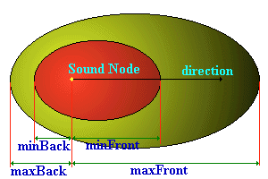

# The Church of Noise

In order to make your world more interesting, we can add sound to it. This can take the form of ambient background noise,
doorbells, warning sirens, anything you like. It's all done with two types of node, the **Sound** and **AudioClip**
nodes. You can imagine a **Sound** node as specifying where in space you can hear a sound, and where it originates from. The actual sound
itself is specified by the **AudioClip** node. First of all, we'll deal with the **Sound** node.

## Sound

The **Sound** node is used to specify the positioning and orientation of a sound source in your world. The **Sound**
node is positioned at a certain place, and whether you can hear the sound or not depends on where you are in relation to it.
The sound is emitted in an ellipsoid pattern, as shown in the picture below:



Inside the red area, the sound is heard at full intensity. Inside the yellow area, the sound fades with distance from the source.
The **minFront**, **maxFront**, **minBack**, and **maxBack** distances are fields specified in the **Sound** node,
as is **direction**. The actual syntax of the **Sound** node is as follows:

```
Sound {
   SFVec3f     direction         0 0 1
   SFFloat     intensity         1
   SFVec3f     location          0 0 0
   SFFloat     maxBack           10
   SFFloat     maxFront          10
   SFFloat     minBack           1
   SFFloat     minFront          1
   SFFloat     priority          0
   SFNode      source            NULL
   SFBool      spatialize        TRUE   
}
```

The other fields operate as follows: **direction** is a vector specifying the direction that the sound node points in.
**intensity** is the volume of the sound. A value of 1 is the full volume as found in the sound file, and 0 is silent.
**location** is the position of the sound source in the world. The four max/min Front/Back parameters specify the
shape of the ellipsoid, as shown above. For instance, to have a sound that was equally audible in all directions, you would
have **maxFront=maxBack**, and **minFront=minBack**. If you didn't want this sound to decrease with distance, you would set
all the values to the same distance, which should be plenty big enough to cover your entire world in this case. If you
do want to make your sound tail off with distance, setting the max values to 10 times the min values gives a realistic drop-off rate.


**priority** is the importance of the sound. The browser will only have a certain number of sound channels available to
it, and the **priority** of a sound is used to determine which ones are played. This takes values from 0 to 1. Low-priority
background sounds should have a value of 0, and high-priority, short sounds like doorbells or whatever should have a value
of 1.


The **spatialize** field is used by the browser to determine whether it should spatialize the sound. This means it will 
play the sound through the speakers as though coming from the source of the sound, so you will hear the sound moving when 
you move relative to the it. If this field is FALSE, the browser will not do this. This is useful both for optimization and
creating ambient sounds.


Only one field left in the **Sound** node, and that is the **source** node. This is the really important one. It can contain 
either a **AudioClip** node or a **MovieTexture** node. If you use a **MovieTexture**, the browser will play the 
sound from the movie file specified. This can be useful for playing back MPEG sound files, for instance. More useful is the 
**AudioClip** node, which we'll cover in detail now!

## AudioClip

The **AudioClip** node actually specifies what will be played by the sound node, and when. The syntax is as follows:

```
AudioClip {
   SFString    description       ""
   SFBool      loop              FALSE
   SFFloat     pitch             1.0
   SFTime      startTime         0
   SFTime      stopTime          0
   MFString    url               []
}
```

The **AudioClip** functions like this. The **url** field is a list of files in uncompressed .WAV format, or 
General MIDI .MID type 1 format, which is useful for compact representation of music. The browser
will play the first of these that it can load. **loop** specifies whether the sound loops, which is useful for ambient sounds,
and **description** is a description of the sound, which the browser can display if it so desires. **pitch** is a multiplier
for the speed of playback, and hence the pitch of the sound. A **pitch** of 1.0 is the normal speed. A **pitch** of 0.5 will 
play back at half the speed, and transpose the sound down an octave. A value of 2.0 will have the opposite effect, doubling the 
speed of the sound, and raising the pitch by an octave. 

**startTime** and **stopTime** are SFTime values, which specify when the sound will start and stop. If you remember,
these are a number of seconds since 1st January 1970, which may not seem much use, but when linked up with sensors and routes,
makes a lot more sense. A sensor will generate a eventOut with the time it is activated, and if this is routed to an **AudioClip**
node, via the **set_startTime** eventIn, it will play the sound. We'll see more about that later when we actually cover 
sensors and interaction, but we don't know enough about them yet to do that.

## Fade Away...

One thing to say about sound nodes, is that uncompressed .WAV files are HUGE, and take absolutely ages to download. Therefore, 
they should be used very sparingly for the sake of efficiency. MIDI files are better, and should be OK for background music, but try
to steer clear of .WAV files as much as you can. If you do have them, make them short and low-quality, otherwise no-one will
ever wait around for your 10-minute CD-quality .WAV to download.


That's all you need to know about basic sound stuff. In order to actually produce useful sounds, like doorbells and so on, 
we need to be able to interact with the world, through sensors and things like that. We haven't covered those yet, so I'll leave the
demonstration of interactive sounds for now, and just add some drum noises coming from the podium to the example world. Later on, I'll 
cover sensors and we'll be able to do more impressive things.<BR><A HREF="../worlds/tut23.wrl" TARGET="_new">Tutorial 2.3 World</A> and <A HREF="../source/tut23.html">code</A>.


That's about it then, next tutorial I'll show you how to make more realistic and useful shapes with advanced objects.

