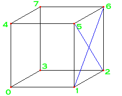

# Objects Of Desire

Now, it's all very well being able to do all this fancy stuff, but if you've only got Boxes, Cones, Spheres, and Cylinders, 
how far are you going to get? Not very. That's why VRML provides a number of other geometry nodes. You can use these to build
up arbitrary or complex shapes to enhance your world. I'm going to cover the basic fields of these nodes, so that you can
get going and use them. I'll cover the more complex fields that allow you to change the look of the nodes in the next tutorial.
Anyway, we'll start with the most fundamental of these advanced geometry nodes, the <STRONG>IndexedFaceSet</STRONG>.

## IndexedFaceSet

The <STRONG>IndexedFaceSet</STRONG> node is a collection of faces, which you define manually, and hence build up your own objects of any
shape. The basic idea is very simple, as shown in the diagram below:

Say you want to define a cube, or part of a cube. You first need to define the eight vertices, numbered 0-7 in the diagram. 
Then, you need to define the faces. To define the face with the blue cross on it, you would say that it uses the vertices
1, 2, 6 and 5. And that's all there is to it. Do that for each face, and you've done it! One word of warning. If the vertices
of a face are not coplanar (i.e. are not all on a flat plane), then the browsers will get confused and the results are undefined.
It is best to use triangular faces, with only three points to a face, as then they will always be coplanar. If you want more
vertices per face, be very careful. However, you can make up any shape out of triangles, so that's probably the best way to go.

The actual syntax of a basic <STRONG>IndexedFaceSet</STRONG> node is as follows:

<PRE>
IndexedFaceSet {
   SFNode      coord             NULL
   MFInt32     coordIndex        []
   SFBool      solid             TRUE
}
</PRE>
The <STRONG>coord</STRONG> field contains a <STRONG>Coordinate</STRONG> node, which simply consists of a list of 3D points, as shown in the example below.
These are the points that will make up your <STRONG>IndexedFaceSet</STRONG>. The next field is <STRONG>coordIndex</STRONG>. This is the face list.
To define a face, you enter the index of each point on it in this list, followed by a -1 to indicate that one face is finished
and another can start. The index of the point is its number in the coordinate list. If you are looking at the face, the index values
should be entered in anticlockwise order for the face to be facing you, and not away from you. The only other field is <STRONG>solid</STRONG>. If your 
object is not fully closed, you need to tell the browser to draw the inside faces, otherwise it won't. So, you can set <STRONG>solid</STRONG>
to FALSE in this case. The example below defines a cube with two faces missing, which isn't solid. It is the one seen in the 
example at the end of the tutorial. There is a lot more you can do with <STRONG>IndexedFaceSet</STRONG>s, but these involve using colours and normals,
which we haven't got to yet. This will all be covered in the next tutorial.

<PRE>
IndexedFaceSet {
   coord Coordinate {
      point [  -2 0 2, 2 0 2, 2 0 -2, -2 0 -2
               -2 4 2, 2 4 2, 2 4 -2, -2 4 -2]
   }
   coordIndex [0 4 7 3 -1
               1 2 6 5 -1
               4 5 6 7 -1
               2 3 7 6 -1 ]
   solid FALSE
}
</PRE>
## IndexedLineSet

A very close relative of the <STRONG>IndexedFaceSet</STRONG> is the <STRONG>IndexedLineSet</STRONG>. This node defines a number of lines to be drawn in the world
between coordinates. This is useful for just having thin lines, or for making wireframe objects. It's all done in exactly the same 
way as for the <STRONG>IndexedFaceSet</STRONG>, except that there is no <STRONG>solid</STRONG> field, and the <STRONG>coordIndex</STRONG> field specifies
the point indices for each line, with a -1 in between each one.

<PRE>
IndexedLineSet {
   SFNode      coord             NULL
   MFInt32     coordIndex        []
}
</PRE>

The 'ropes' in the example are done with an <STRONG>IndexedLineSet</STRONG>. The lines are infinitely thin.
They are coloured, but not textured, as there is nothing to texture. If the <EM>color</EM> field of
the <STRONG>IndexedLineSet</STRONG> is empty, the colour is specified by the <EM>emissiveColor</EM> field of the
<STRONG>Appearance</STRONG>. Lines are not affected by collision detection, so the viewer can walk straight
through them.

## PointSet

Again, pretty much identical to <STRONG>IndexedLineSet</STRONG>, <STRONG>PointSet</STRONG> defines a set of points in space. These are drawn at a size
determined by the browser, which there is no way to change at present. This node is identical to the previous one, except it has no
<STRONG>coordIndex</STRONG> field, as there are no connections between the points. The points are drawn in the same way as lines, and are 
not affected by collision.

<PRE>
PointSet {
   SFNode      coord             NULL
}
</PRE>
## ElevationGrid

The next two nodes are both specialised and optimised versions of the <STRONG>IndexedFaceSet</STRONG>. The first of these I will cover is
the <STRONG>ElevationGrid</STRONG>. In a world, it is common to want to display a ground plane. Now, a flat plane isn't very interesting, so
you can use an <STRONG>ElevationGrid</STRONG> instead. This allows you to create a ground plane with variable height. This is done by
specifying a number of heights, which are made into a grid. The grid size is specified with <STRONG>xDimension</STRONG> and <STRONG>zDimension</STRONG>
fields, and the <STRONG>xSpacing</STRONG> and <STRONG>zSpacing</STRONG> fields. These define the dimensions and spacing between the points in both
the X and Z directions. The list of points starts from the one in the far left, proceeding to the near right corner, when looking down the
-Z axis. If the <STRONG>solid</STRONG> field is TRUE, the object is not visible from beneath. If you need it to be, set it to FALSE. The basic syntax is shown below.

<PRE>
ElevationGrid {
   MFFloat     height            []
   SFBool      solid             TRUE
   SFInt32     xDimension        0
   SFFloat     xSpacing          0.0
   SFInt32     zDimension        0
   SFInt32     zSpacing          0.0
}

ElevationGrid {
   xDimension 6
   zDimension 6
   xSpacing 5.0
   zSpacing 5.0
   height [ 1.5, 1, 0.5, 0.5, 1, 1.5,
            1, 0.5, 0.25, 0.25, 0.5, 1,
            0.5, 0.25, 0, 0, 0.25, 0.5,
            0.5, 0.25, 0, 0, 0.25, 0.5,
            1, 0.5, 0.25, 0.25, 0.5, 1,
            1.5, 1, 0.5, 0.5, 1, 1.5]
}
</PRE>

In this example, there are 6 points in both the X and Z directions, and the points are 5 metres apart in both directions. This produces a square
grid 25 metres to a side. The values in the <STRONG>height</STRONG> field are the heights at each point. The first is placed at 0,0, and the last will be
at +25, +25. This object also has more advanced fields that will be covered next time.

## Extrusion

The last of these geometry nodes to cover is the <STRONG>Extrusion</STRONG>. This takes a 2D cross-section and extrudes it along a path, called a spine.
You can also alter the scale at each point, shrinking and expanding the cross-section. The syntax is shown below:

<PRE>
Extrusion {
   SFBool      beginCap          TRUE
   MFVec2f     crossSection      [1 1, 1 -1, -1 -1, -1 1, 1 1]
   SFBool      endCap            TRUE
   MFVec2f     scale             1 1
   SFBool      solid             TRUE
   MFVec3f     spine             [0 0 0, 0 1 0]
   MFRotation  orientation       0 0 1 0
}
</PRE>

The <STRONG>crossSection</STRONG> field is a list of 2D points, in anticlockwise order, which define the cross-section of the extruded object.
This section is extruded along the line defined by the <STRONG>spine</STRONG> field, which is a list of 3D points. At each point in the spine,
you can define a scale factor, in the <STRONG>scale</STRONG> field, a list of pairs of float values, one each for the X and Z directions. 
The <STRONG>solid</STRONG> field is the same as before, and the <STRONG>beginCap</STRONG> and <STRONG>endCap</STRONG> fields define whether the extrusion has a
cover over either end. The <STRONG>orientation</STRONG> field defines a list of rotations, one for each point
on the spine. This allows you greater control over the shape of your extrusion. If there are not
enough rotations to have one for each point, the surplus points use the last rotation in the list.
So, this example would extrude a square along a four-point spine with varying scale factors:

<PRE>
Extrusion {
   crossSection [1 1, 1 -1, -1 -1, -1 1, 1 1]
   spine [0 0 0, 0 2 0, 1 3 0, 2 3 0]
   scale [1 1, 1 0.5, 0.5 1, 0.5 0.5]
}
</PRE>

You can see what this extrusion actually looks like up close in this <A HREF="../worlds/tut24a.wrl" TARGET=_new>example</A> and the associated <A HREF="../source/tut24a.html">code</A>. One important thing
to remember with extrusions is that, when creating the cross-section, you need to repeat the starting point at the end if you want
it to be closed.

## Winding it up
You can see the effects of all this stuff by taking a look at the example world. The 'tent' is an <STRONG>IndexedFaceSet</STRONG>, the 'ropes'
are an <STRONG>IndexedLineSet</STRONG>, the ground is an <STRONG>ElevationGrid</STRONG> and the 'thing' is an <STRONG>Extrusion</STRONG>. There's no <STRONG>PointSet</STRONG>, as 
I couldn't think of a decent use for it. Still, you don't really need an example for that, it's so simple. Anyway, take a look at the example
for this tutorial:
 <A HREF="../worlds/tut24.wrl" TARGET=_new>Tutorial 2.4 World</A>
and <A HREF="../source/tut24.html">code</A>.

Right. That's the basics of these advanced objects. Next tutorial I'll cover normals, colors and so on to make these objects look
better.

