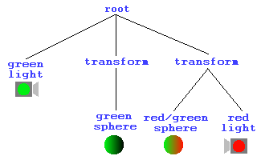
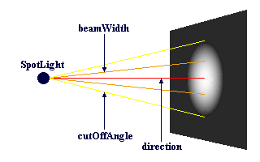

# Light Of My Life

This tutorial is all about lighting up your worlds. Up to now, we've relied on default (ie none) lighting. The default <EM>headlight</EM> setting is TRUE, so up to
now we've been illuminating our world with a headlight. This is all about to change. From now on, your worlds will be dazzlingly lit with an array of effects such
as you have never seen before. Maybe.

## Lighting in VRML

The first thing to mention is the way that the VRML lighting model works. All lights have the following fields: <EM>color</EM>, <EM>ambientIntensity</EM>, and <EM>intensity</EM>.
Each light has an intensity, which a value between 0 and 1 corresponding to its brightness. It also has an ambient intensity, also between 0 and 1, which is how much light it 
contributes to the general ambient light in the scene. Because of this, the more lights in the scene, the brighter the ambient illumination, which makes sense. <EM>Ambient</EM> 
light is light that shines on every surface in the scene, simulating light scattered from other objects. Each light also has a colour associated with it, which surprisingly enough 
is the colour of the light it emits. The direct light emitted by a light source is calculated by <STRONG>intensity * color</STRONG>. The ambient light contributed to the scene is 
<STRONG>ambientIntensity * color</STRONG>. Each light source also has an area of effect, so as to keep VRML worlds enclosed and scalable. The method of doing this varies between the different types.

Most VRML browsers calculate lighting by working it out for each corner of a face, and interpolating the shading between these vertices. This means that if you have a huge face 
with a light source shining on the middle of it, with corners that are very distant, you will NOT get a light spot on the face. It will all be uniformly dark. This is an important 
thing to bear in mind. Another important point to notice is that faces are only lit if they have a Material node. Objects with textures will not be affected by lighting. This is awkward, 
and you may have to produce pre-lit textures to compensate if you need shading on them. Another very important thing to remember is that by default, VRML worlds will have the user's 
headlight ON. This will seriously screw the careful lighting in your worlds, so remember to turn it off if you feel it necessary. This is done by inserting a <EM>headlight FALSE</EM>
line into a <STRONG>NavigationInfo</STRONG> node, as shown in the code sample below. We'll cover the <STRONG>NavigationInfo</STRONG> in one of the later tutorials, but for now you can just include this in your files
to turn off the headlight. It just goes at the top level of the scene graph, like <STRONG>WorldInfo</STRONG>. We'll come back to it, don't worry.

<PRE>
NavigationInfo {
   headlight FALSE
}
</PRE>

More information on the VRML lighting model can be found in the specification, mirrored on this site, <A HREF="http://www.web3d.org/technicalinfo/specifications/vrml97/part1/concepts.html#4.14">here</A>, but that should be enough to
get you going. I suggest that you read the lighting model spec before you do anything particularly advanced.

## DirectionalLight

Right then, time to get down to business. The first light node we'll cover is the <STRONG>DirectionalLight</STRONG> node. This is a light that shines from a uniform direction, like a set of parallel
rays. This gives an effect like that of the Sun, where everything is illuminated from the same direction. The <STRONG>DirectionalLight</STRONG> node does not have a location in the worlds space, but 
simply exists.

It illuminates everything that is a child of its parent, so everything at its level in the hierarchy and below. 
This <A HREF="../worlds/tut26a.wrl" TARGET=_new>example</A> (<A HREF="../source/tut26a.html">code</A>)shows the scoping of the <STRONG>DirectionalLight</STRONG> node. Both Spheres are lit by a green light from behind, but the one
on the right is also lit by a red light pointing from in front of it. This is because the green light is at the top level in the file, so illuminates everything. The red
light, however is grouped in the same node as the sphere it shines on. The other sphere is in a separate part of the scene graph, so is not lit. This is demonstrated in this diagram.

The <STRONG>DirectionalLight</STRONG> node has the basic light fields of <EM>intensity</EM>, <EM>color</EM>, and <EM>ambientIntensity</EM>. It also has an <EM>on</EM> field, which
is simply TRUE or FALSE, indicating whether the light is on or off. It also has a <EM>direction</EM> field, which is a vector corresponding to the direction that the light
shines in. The default value of 0 0 -1, for instance, indicates that the light shines from +Z towards the origin, or down the -Z axis. The full definition of the <STRONG>DirectionalLight</STRONG>
node is shown below.

<PRE>
DirectionalLight {
   exposedField   SFFloat     ambientIntensity  0
   exposedField   SFColor     color             1 1 1
   exposedField   SFVec3f     direction         0 0 -1
   exposedField   SFFloat     intensity         1
   exposedField   SFBool      on                TRUE
}
</PRE>
## PointLight

A <STRONG>PointLight</STRONG> is light that emanates from a particular point in space, spreading equally in all directions. Unlike the <STRONG>DirectionalLight</STRONG>, this node actually
has a position in space, specified in its <EM>location</EM> field. This is the point from which the light will emanate. The effect of the <STRONG>PointLight</STRONG> is limited in a different
way to the <STRONG>DirectionalLight</STRONG>. Rather than being scoped by its position in the scene hierarchy, is it scoped by its position in space. It has fields that perform this scoping, the <EM>radius</EM> field.
The <EM>radius</EM> of the light is the maximum distance at which objects will be illuminated. Within this radius, the intensity of the light is affected by a set of attenuation constants. These are 3 floating point
values (stored as an SFVec3f) that affect the lighting with the following formula:

<PRE>
1 &#47; (attenuation[0] + attenuation[1]*r + attenuation[2]*r2)
</PRE>

This means that the 3 values in the attenuation field are used as coefficients in a quadratic formula for the intensity of the light at a distance <EM>r</EM>. It is left up to you to experiment with
different coefficients. The default value of <STRONG>1 0 0</STRONG> gives no attenuation, giving a sharp limit to the effect of the light. To make the light fall off linearly, you would have an attenuation of the form <STRONG>0 x 0</STRONG>.
I'll leave you to experiment, but I'll leave this node with this <A HREF="../worlds/tut26b.wrl" TARGET=_new>example</A> (<A HREF="../source/tut26b.html">code</A>). The set of spheres on the left is lit with attenuation constants of
<STRONG>0 1 0</STRONG>, giving a linear attenuation. The right-hand set is lit with non-linear attenuation constants of <STRONG>0 0 1</STRONG>, causing the light to fall off in an r2 kind of way. Bear in mind that this
may not look correct on your system, depending on the renderer used by your browser. Direct3D renderers do not seem to support attenuation, so don't worry if you can't see it, it's just your browser limitations. It does work, honest.

<PRE>
PointLight {
   exposedField   SFFloat     ambientIntensity  0
   exposedField   SFVec3f     attenuation       1 0 0
   exposedField   SFColor     color             1 1 1
   exposedField   SFFloat     intensity         1
   exposedField   SFVec3f     location          0 0 0
   exposedField   SFBool      on                TRUE
   exposedField   SFFloat     radius            100
}
</PRE>
## SpotLight

The last lighting node is the <STRONG>SpotLight</STRONG> node. This, obviously enough, defines a spotlight. It has all the standard fields of the normal lighting nodes. It also has the <EM>location</EM>, <EM>radius</EM> and <EM>attenuation</EM> fields 
of the <STRONG>PointLight</STRONG> node. These fields have exactly the same effect as described above, giving a position, a maximum radius, and an attenuation within this radius for the light source. However, it also has a couple of other fields. 
The <STRONG>SpotLight</STRONG> is scoped by its position in space in the same way as the <STRONG>PointLight</STRONG>. However, as it is a light that shines in a particular direction, as well as its <EM>location</EM>, it also has a <EM>direction</EM> field, which defines
the direction that the light points in. 

We can also specify the size of the spotlight produced with two other fields, the <EM>beamWidth</EM> and the <EM>cutOffAngle</EM>. These are angles, which define how wide the main beam will be, and how fast it fades out
at the edges. Note that this <EM>cutOffAngle</EM> is completely unrelated to the <EM>attenuation</EM>. The <EM>attenuation</EM> governs how the light changes in the direction that it is shining, and <EM>cutOffAngle</EM> defines how it falls off at 
the edges of the beam. By default, the <EM>beamWidth</EM> is larger than the <EM>cutOffAngle</EM>, giving a sharp edge to the beam. This increases rendering performance considerably. This diagram shows how <EM>beamWidth</EM> and <EM>cutOffAngle</EM> affect the 
appearance of the beam.

<PRE>
SpotLight {
   exposedField   SFFloat     ambientIntensity  0
   exposedField   SFVec3f     attenuation       1 0 0
   exposedField   SFFloat     beamWidth         1.570796
   exposedField   SFColor     color             1 1 1
   exposedField   SFFloat     cutOffAngle       0.785398
   exposedField   SFVec3f     direction         0 0 -1
   exposedField   SFFloat     intensity         1
   exposedField   SFVec3f     location          0 0 0
   exposedField   SFBool      on                TRUE
   exposedField   SFFloat     radius            100
}
</PRE>
## Darkness Falls

It is worth remembering that if you want any kind of special lighting effect on a surface, such as a spotlight with a soft edge, that surface will have to have many vertices on it and be made up of many faces, as VRML only does lighting at each corner. This 
is a very important thing to remember. If you have a light shining on the middle of a large surface, you will not get the effect you want. Also, different rendering libraries support lighting an attenuation in different ways, so lighting may appear different 
in different browsers. The important thing to do with lighting is to experiment, if possible with different browsers. Go to it! Next time, we'll cover advanced texturing, and then we're on to Part 3 and animation!

