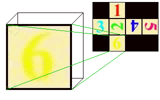

# Slightly Rippled, With A Flat Underside

We've learnt about advanced materials, with colours per vertex, normals, and how to alter the appearance 
of your objects with them. We've done lighting, and how to create effects with the lighting in your worlds.
In all this, textures have been somewhat left behind. We couldn't really do a lot with them before, and with
these new objects, textures have been forgotten about. Well, now we're going to do something about it. This 
tutorial covers texturing in greater detail. We will learn how to transform the textures in your worlds, making
them do interesting things, and getting more control over their behaviour. The first thing to do, though, is to 
take a trip into texture space...

## A trip into texture space

Texture space is where your textures live. It's a two dimensional world, filled with your texture, repeating itself
forever. The origin is the bottom left of your texture, and the point (1,1) is the top right. This is independent of
whether your texture is 320x200, 640x480, 1000x20, whatever its size or aspect ration, the top right is always (1,1) 
in texture space. From now on, I'm going to refer to the texture from (0,0) to (1,1) as the *central* copy of the 
texture. The x-axis in normal space becomes the s-axis, and the y-axis becomes the t-axis. This is all shown in the 
diagram below, a view into the centre of an infinite world of textures.


From now on, I want you to think in terms of texture **coordinates**, instead of textures. The texture coordinate
(1,1) is the top right of the central copy of your texture, and (1.5,0.5) is in the middle of the texture to the right
of the central copy.

Right, now that you're practically a native of the two-dimensional world that is texture space, we can start to warp this 
space to our own ends. We're going to translate it, rotate it, scale it, and squish it about in all sorts of ways. This 
world gives us the power to textures any object we like, any way we like. Great.

## Texture transformations

You remember the **Appearance** node? Well, when we did it the first time, there's something I didn't tell you about it.
You remember that it can contain a **Material** node, an **ImageTexture** node or a **MovieTexture** node? Well, if
you have either of the texture nodes in the *texture* field, you can also have a **TextureTransform** node in the
*textureTransform* field. This is what I'm going to cover now. The syntax of a **TextureTransform** is as follows:

```
TextureTransform {
   exposedField   SFVec2f     center            0 0
   exposedField   SFFloat     rotation          0
   exposedField   SFVec2f     scale             1 1
   exposedField   SFVec2f     translation       0 0
}
```

Notice that all the fields are the two-dimensional equivalents of the normal **Transform** node. The *center* field
specifies the centre point used for rotation and scaling, in texture coordinates. The *rotation* field specifies a rotation
angle about this centre. The *scale* is a pair of values, specifying scale factors relative to the centre in the s and t 
directions. Finally, the *translation* is a pair of values specifying a two-dimensional translation in the s and t directions.

There's one really important point to remember about **TextureTransform**s. They operate on texture *coordinates*, not on the
texture itself. For instance, you might expect a *scale* of 2 2 to make a texture twice as large in both directions, but really it
transforms the coordinate (0.5,0.5) to (1,1), and (1,1) to (2,2). This has the effect of *shrinking* the texture by 2 in both 
directions. While being the opposite of what you might expect, this isn't a problem as long as you remember. This is also the case for rotations
and translations. What you do to the coordinates will have the opposite effect on the actual texture. Take a look at this <A HREF="../worlds/tut27a.wrl" TARGET="_new">example</A>
world, for a few examples of texture transformations. You can also take a
look at the <A HREF="../source/tut27a.html">code</A>.


In the example, the centre box is the original texture, unmodified. On the left, the texture has been scaled by 5 in both directions and rotated by 0.78 radians.
On the right, the texture has been translated by 0.5 in both the s and t directions. As you can see, these transformations have the opposite effect from what you
would expect.

## Texture coordinates

The advanced objects, as well as having *color* and *normal* fields, have a *texCoord* field. This can contain a 
**TextureCoordinate** node.

```
TextureCoordinate {
   exposedField   MFVec2f     point             []
}
```

This is simply a list of coordinates in texture space, which are then used by a *texCoordIndex* field in the IFS (IndexedFaceSet). If you do not specify
*texCoordIndex* data in the IFS, the texture coordinates are mapped to the coordinates of the IFS in order. However, if you do, you can map any part of the image onto
any part of the object. For instance, in the example shown below, the square that the 6 is in is mapped onto one face of a cube.



For a change now, I'm actually going to quote a big piece of code. I'll explain after. Take a look at this...

```
Shape {
   appearance Appearance {
      texture ImageTexture {
         url "d6.jpg"
      }
   }
   geometry IndexedFaceSet {
      coord DEF COORD Coordinate {
         point [ 1 -1 -1, -1 -1 -1, -1 -1 1, 1 -1 1, 1 1 -1, -1 1 -1, -1 1 1, 1 1 1 ]
      }
      coordIndex [3 2 1 0 -1
                  0 1 5 4 -1
                  1 2 6 5 -1
                  2 3 7 6 -1
                  3 0 4 7 -1
                  4 5 6 7 -1
      ]
      texCoord DEF TEXCOORD TextureCoordinate {
         point [  0.25 0, 0.5 0, 
                  0 0.33, 0.25 0.33, 0.5 0.33, 0.75 0.33, 1 0.33,
                  0 0.67, 0.25 0.67, 0.5 0.67, 0.75 0.67, 1 0.67,
                  0.25 1, 0.5 1
         ]
      }
      texCoordIndex [5 6 11 10 -1
                     13 12 8 9 -1
                     7 2 3 8 -1
                     0 1 4 3 -1
                     5 10 9 4 -1
                     9 8 3 4 -1
      ]
   }
}
```

Right then. The **IndexedFaceSet** is simply a cube, two metres along each side. This
takes care of the *coordinate* and *coordIndex* fields. The texture in the
**ImageTexture** node is the image shown above, the net of a cube. Right then. If you
imagine the bottom left of this texture as (0,0), and the top right as (1,1), you can see that the
points in the **TextureCoordinate** node correspond to where the corners of the cube
should lie. Note that the coordinates are entered in this field from the bottom of the image to the
top, and from left to right. This isn't important, it's just the way I've done it here. Then, in the
*texCoordIndex* field, we map the texture coordinates onto the actual object vertices. The
numbers in this field correspond to the texture coordinates defined in the *texCoord* field.
They are ordered the same as the coordinates in the *coordIndex* field. This field is
formatted in exactly the same way, as well, with a value of -1 between each face. You can actually
see what this looks like in reality by looking at the <A HREF="../worlds/tut27b.wrl"
TARGET="_new">example</A> in 3D, and also its associated <A HREF="../source/tut27b.html">code</A>.

## Back down to Earth

Well, that's it for this one. Next, we're going to cover the **NavigationInfo** node, which you can use to customise how the user views your world.

