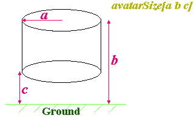

# Move Over I'll Drive

Right then. Before we get on to the animation stuff, there's one more node I promised I'd cover before too long. This is the **NavigationInfo** node, and you can use it to 
change the user's experience of your world. It allows you to customise the various user parameters of the browser. Most browsers let the user change these themselves, but you can tell it
what to set them to on entering your world. The definition is as follows:

```
NavigationInfo {
   eventIn        SFBool      set_bind
   exposedField   MFFloat     avatarSize        [0.25, 1.6, 0.75]
   exposedField   SFBool      headlight         TRUE
   exposedField   SFFloat     speed             1.0
   exposedField   MFString    type              "WALK"
   exposedField   SFFloat     visibilityLimit   0.0
   eventOut       SFBool      isBound
}
```

The node has two events, the *set_bind* and *isBound* events. This is because the node is **bindable**. This is, however, something to be covered later, in its own tutorial. For now, just ignore them.
The **NavigationInfo** node is a root node, so can be placed at the top of the scene graph, inside *children* fields, and so on. You can have any number in one file, but only one will be bound at a time (again, we'll come back to it later).
For now, just use one per file. We'll do more complex stuff later. 


The settings you can manipulate are represented by the fields in the node. The first we'll discuss is the *headlight* field. The user can change this one, but you get to specify the default. A default VRML file has the user's headlight ON, which is useful in an unlit scene.
However, in your elaborately lit worlds, this is just irritating and unnecessary. So, you can turn it off by putting *headlight FALSE* into your **NavigationInfo** node. You can also specify the *visibilityLimit* of your world. This is the distance from the user beyond which nothing will be drawn. You can use 
this to speed up the rendering in large worlds. If it is set to 0.0 (the default), there is no limit to visibility. The next field is the *speed* field. This is a multiplier that the browser uses to work out the speed of the user when he is moving. As some browsers allow variable speeds, this is a 
hint to the browser as to generally how fast the user should be able to move. A value of 3.0 will allow the user to move three times as fast as normal, and a value of 0.5 will halve his speed at any time.


The *type* field is the field that determines how the user moves around your world. The field can take a number of different values. These are:


* "WALK", where the user walks around and is affected by gravity,
* "FLY", where the user moves around unaffected by gravity,
* "EXAMINE", where the user remains static, but can rotate the world around to view it from various angles, and
* "NONE", where the user has no movement controls at all.


You can take a look at the different styles in the four worlds below. You'll notice that "WALK" and "FLY" are exactly the same, except that "WALK" will not let you leave the ground, whereas "FLY" will.
<BR><A HREF="../worlds/tut28a.wrl" TARGET="_new">"WALK"</A> (<A HREF="../source/tut28a.html">code</A>)
<BR><A HREF="../worlds/tut28b.wrl" TARGET="_new">"FLY"</A> (<A HREF="../source/tut28b.html">code</A>)
<BR><A HREF="../worlds/tut28c.wrl" TARGET="_new">"EXAMINE"</A> (<A HREF="../source/tut28c.html">code</A>)
<BR><A HREF="../worlds/tut28d.wrl" TARGET="_new">"NONE"</A> (<A HREF="../source/tut28d.html">code</A>)


The choice of a number of navigation types gives great flexibility in how VRML can be used. With the field set to "WALK" or "FLY", you have a fairly standard virtual world feel. With "EXAMINE", you could have a model of a car or other product, which the user can inspect from all sides easily. Finally, if you
set the field to "NONE", you constrain the user to watch whatever you put in front of him. This could be used for 3D movies, animations, or advertisements. The logo on the main page uses this mode of interaction.


The last thing to deal with here is the *avatarSize* field. This allows to to specify the physical size of the user's presence (or *avatar*) in the world. This field contains three scalar values. These represent, in order, the avatar's:

* radius,
* view height,
* knee height.


The avatar is treated as a cylinder shape for collision detection. The cylinder has proportions as shown in the diagram below:



The radius and total height are fairly obvious, but the knee height requires a little explanation. When the user is in "WALK" mode, he can step up and down steps, but which steps he can go up is governed by the knee height.
The avatar can only climb a step that is lower than the specified knee height. This allows you to create steps and so on that the avatar can climb, while still having walls and so on.

