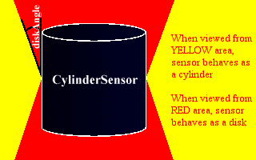

# It's Rude To Point

This tutorial, we're going to cover the four remaining sensor nodes, which can be used to obtain input from
the user. These sensors detect mouse clicks, drags, and other operations. You can use them to move objects,
start animations, and many other things. Once we've done these, we can carry on to do interpolators, and get
down to some *real* animation.

## TouchSensor

Right then, the first sensor we're going to consider in this tutorial is the **TouchSensor**. This detects mouse interaction
with its sibling geometry. When the mouse is moved over the geometry, an *isOver* TRUE event is generated, and when it moves off,
an *isOver* FALSE is sent. When any of the mouse buttons is clicked while *isOver* is TRUE, an *isActive* TRUE event is 
sent when the button is clicked, and an *isActive*FALSE is sent when it is released. The *touchTime* eventOut is sent when a
button is clicked and released over the geometry. If the cursor is removed from the geometry before the button is released, the event is not sent. If it is, the time 
of the release is sent in the event.
```
TouchSensor {
   exposedField   SFBool      enabled           TRUE
   eventOut       SFVec3f     hitNormal_changed
   eventOut       SFVec3f     hitPoint_changed
   eventOut       SFVec2f     hitTexCoord_changed
   eventOut       SFBool      isActive
   eventOut       SFBool      isOver
   eventOut       SFTime      touchTime
}
```
While *isOver* is TRUE, the other three events are generated whenever the appropriate value changes. *hitNormal_changed* sends the normal 
of the surface at the hit point, and *hitPoint_changed* sends the position of the hit point. *hitTexCoord_changed* sends a texture coordinate, and
could be used in conjunction with the appropriate scripts to make a VR image map on the surface of an object. For instance, imagine a virtual keyboard, a box 
with a keyboard texture. Instead of a separate **TouchSensor** (and hence separate geometry) for each key, you could have one **TouchSensor** linked to a 
script to detect the *hitTexCoord_changed* events and take appropriate action when each key is hit. This could be used for VR password entry and so on.

Take a look at this <A HREF="../worlds/tut33a.wrl" TARGET="_new">example</A> and its <A HREF="../source/tut33a.html">code</A>. The world contains one **Group**, containing another **Group**, a **Transform**, and a **TouchSensor**. The
first **Group** contains a **Sphere** and another **TouchSensor**. The *hitPoint_changed* event from this sensor is routed to the *translation* field of the 
**Transform**. This contains another, smaller **Sphere** and a **Sound** node. This makes the small sphere (and the sound) follow the hit point on the larger sphere, which 
changes when the user moves the mouse over it. The first **TouchSensor**s *touchTime* field is routed to the *startTime* of the **Sound**. So, the effect of all this is that 
when the user moves the mouse over the large sphere, the small sphere moves around, following the hit point. When the user clicks, the "pop!" is heard. The structure of this example is slightly complex
so that the user can click on either the small or large spheres to start the sound, but I'm sure you can handle it!

## SphereSensor

Now, we come across a class of sensors called *Drag sensors*. Now, this doesn't mean they *wear* drag, it means that you can drag them around. More specifically, you can use them to rotate, slide, and
otherwise drag objects around with the mouse. The simplest of these is the **SphereSensor**, so we're going to look at that one first.

```
SphereSensor {
   exposedField   SFBool      autoOffset        TRUE
   exposedField   SFBool      enabled           TRUE
   exposedField   SFRotation  offset            0 1 0 0
   eventOut       SFBool      isActive
   eventOut       SFRotation  rotation_changed
   eventOut       SFVec3f     trackPoint_changed
}
```

The **SphereSensor** allows you to rotate an object about the local origin of the sensor. The sensor detects mouse 
clicks, like all the others, on its sibling geometry. The user can then drag the sensor around, rotating the object, 
by moving the mouse with the button held down. There are two ways in which the sensor can be used. This is set by the 
*autoOffset* field. If *autoOffset* is TRUE, the rotation will be kept between hits on the geometry. If it is FALSE, 
each time the user touches the geometry, the rotation will be reset to 0. It's a lot easier to explain if you take a look at 
this <A HREF="../worlds/tut33b.wrl" TARGET="_new">example</A> and its <A HREF="../source/tut33b.html">code</A>.


If the sensor is used with *autoOffset* TRUE, when the mouse button is released, the value of *offset* is set to the 
current rotation. When the user next clicks on the object, the previous rotation offset will be preserved. If *autoOffset* 
is FALSE, the *offset* value is never changed. The *offset* field contains the rotation by which the sensor will be 
initially offset next time it is clicked on. As for the other fields, *enabled* is self-explanatory, as is the *isActive* 
event, which has the same effect as in the **TouchSensor**. The *trackPoint_changed* event has the same effect as for the 
**TouchSensor**. *rotation_changed* is where the useful events are sent out, and the rotating object effect is achieved by 
ROUTEing this to the rotation field of a **Transform** node.


Note, it is a very bad idea to ROUTE a sensor to its own parent **Transform**. Why? Well, feel free to try it for yourself. 
You can get some VERY unpredictable behaviour. As the object geometry rotates, so does the sensor, so when you next click it, 
the behaviour is very different from what you would expect. In the examples, the **SphereSensor** is contained in a **Group** 
along with another **Transform**. This **Transform** then contains the sensor geometry. The sensor's *rotation_changed* 
events are ROUTEd to the *rotation* field of this Transform. In this way, the object rotates when you click on it (as the sensor 
detects hits on siblings and their children), and the sensor does not. This is the ideal behaviour. If you want something complex, it 
can take a bit of good design to eliminate unwanted behaviour (as in the **TouchSensor** example above). This can involve adding 
extra **Group**s and **Transform**s where you might not expect to need them.

## CylinderSensor

The next one is the **CylinderSensor**. This is very very similar to the **SphereSensor**, but is constrained to rotate only around its local y-axis. The **SphereSensor** can rotate about any axis, but the **CylinderSensor** can only rotate about the y-axis. If you want to rotate it about the z-axis, you have to rotate the entire sensor with a surrounding **Transform**. Let's take a look at the sensor definition, and see what we recognise.

```
CylinderSensor {
   exposedField   SFBool      autoOffset        TRUE
   exposedField   SFFloat     diskAngle         0.262
   exposedField   SFBool      enabled           TRUE
   exposedField   SFFloat     maxAngle          -1
   exposedField   SFFloat     minAngle          0
   exposedField   SFFloat     offset            0
   eventOut       SFBool      isActive
   eventOut       SFRotation  rotation_changed
   eventOut       SFVec3f     trackPoint_changed
}
```

Well, all the events are the same as before, as are the *autoOffset*, *offset*, and *enabled* fields. 
The new ones are *diskAngle*, *maxAngle* and *minAngle*. We'll look at *diskAngle* first. If you 
think about it, there are two intuitive ways to rotate a cylinder on the screen. If you are looking from the side, 
you would expect to grab the side of the cylinder, and pull it across the screen to rotate it. The further you pull, the further it rotates, 
until you hit the edge of the screen. The other way, if you are looking down on the cylinder, would be to
pull a point round in a circle on the screen to rotate it. Which does VRML do? Both. This is the purpose of the 
*diskAngle* field. If you are looking at the cylinder with an angle &lt*diskAngle* between you and its
y-axis, it will behave like a disk, and you can pull it in a circle. Otherwise, you pull the sides across the 
screen to rotate it. It's again easier to get if you look at this <A HREF="../worlds/tut33c.wrl" TARGET="_new">example</A> (and <A HREF="../source/tut33c.html">code</A>) and 
play about with the two cylinders. One is oriented with its y-axis pointing up, and one is pointed towards you.
Play about and rotate the two cylinders until you are happy with the concept of how the *diskAngle* works. The idea is also illustrated in
this diagram.



*maxAngle* and *minAngle* are used to constrain the rotation of the cylinder to a certain number of radians around the y-axis of the sensor. If *minAngle* is greater than *maxAngle* (which is the default)
the sensor is free to rotate to any angle. If otherwise, it can only move between the limits set by the two fields. This could be used to make virtual volume controls, for instance, or dials to set other similar sorts of values.

## PlaneSensor

OK then. The last drag sensor, and indeed the last of the sensors in general is the **PlaneSensor**. The previous sensors, you could rotate around an axis. This one, you can drag around
a plane in two dimensions. That is, it can be moved in its local X and Y directions. Its local Z coordinate is fixed at 0. This sensor is a very useful one in user interfaces, as it can be used to create
a slider device, which as we all know is one of the main 2D user interface components. Enough of the speculation, anyway, let's take a look at the definition of the **PlaneSensor**.

```
PlaneSensor {
   exposedField   SFBool      autoOffset        TRUE
   exposedField   SFBool      enabled           TRUE
   exposedField   SFVec2f     maxPosition       -1 -1
   exposedField   SFVec2f     minPosition       0 0
   exposedField   SFVec3f     offset            0 0 0
   eventOut       SFBool      isActive
   eventOut       SFVec3f     trackPoint_changed
   eventOut       SFVec3f     translation_changed
}
```

Again, as with the other drag sensors, we have the *isActive*, *enabled*, *trackPoint_changed*, *autoOffset*, and *offset* fields and events. By now, you should know what these do, so I won't explain again.
When the sensor is moved, the new position is output through the *translation_changed* eventOut during the movement. The *maxPosition* and *minPosition* are the two fields that determine how far the sensor can move in each direction.
These are SFVec2f values, as the position is only in two dimensions, X and Y. If the maximum and minimum in one axis are the same, the sensor cannot move in that axis. If the minimum is higher than the maximum (the default), the sensor in unconstrained
in that axis, and can move any distance. Otherwise, it can only move between the minimum and maximum values. In this <A HREF="../worlds/tut33d.wrl" TARGET="_new">example</A>, the sliding box has been constrained to move in only the X dimension, by making the maximum and minimum Y both 0.
You can also take a look at the <A HREF="../source/tut33d.html">code</A> for this example. 

## Hands Off!

Finally, finished the sensors. Next, I'll do Interpolator nodes, which you can use to, um, interpolate stuff. Great.
