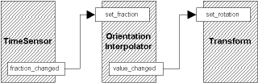

# Inbetweener

## Interpolators and Animation

Right then, this time out we're going to learn about Interpolator nodes. These nodes are very important for animation, but really are very simple.
The general concept is that they are used to change a certain value over time. Depending on what sort of value you want to change, there are six different
interpolator nodes. They are very similar in behaviour however, so we'll cover them all at once and give a big demo at the end.


You would use an interpolator where you want to change a value over time. They take timing signals from a **TimeSensor** or similar, and perform a linear interpolation between
sets of values called *keyValue*s. For each keyValue there is a *key*, which is a fraction from 0 to 1. Now, as you remember, a **TimeSensor** outputs *fraction_changed* events as regularly
as it can. This can be routed to the *set_fraction* eventIn of an interpolator to set the correct point in the interpolation cycle. So, if you route a **TimeSensor** with a *cycleInterval* of 10 to an
interpolator, the interpolator will cycle through its keys every 10 seconds.


Now, every time an interpolator receives an eventIn, it generates an eventOut with the appropriate interpolated value. This can be routed to anything of the appropriate type to change its value. So, the overall animation chain
for an interpolator looks like the diagram below. Note, this diagram uses the OrientationInterpolator and a Transform node to demonstrate the ROUTEing.



## Interpolator Types

OK, let's take a look at the actual nodes themselves. You can use these in any of the normal places, so at the root of the file, in transform nodes, wherever. As they are nodes purely concerned with the animation engine,
they can go anywhere in the scene hierarchy, it doesn't matter.


All the nodes have the same fields, but with different types for the *keyValue* field and the *value_changed* eventOut. So, first we have a *set_fraction* eventIn, which receives events from **TimeSensors** or otherwise. This sets the current stage in the animation cycle, 
and sets how far through the interpolation we are. The next field is the *key* field. This is a sequence of numbers from 0 to 1 corresponding to the key points in the animation. So, if at fraction 0 you want a position to be a certain value, and likewise at fractions 0.5 and 1.0, you would have 
a *key* field of [0, 0.5, 1], each number representing the fraction of each keyframe. Each key has a corresponding entry in the *keyValue* field, so if we follow the above example (using the **ScalarInterpolator** which interpolates SFFloat values), we could have a *keyValue* field of 
[0.0, 10.0, 0.0]. At fraction 0, the output would be 0.0, and fraction 0.5 it would be 10.0, and at 1 it would be 0.0 again. Between these times the value is linearly interpolated, so at fraction 0.25, the value will be 5.0. This value is output along the *value_changed* eventOut whenever a *set_fraction*
event is received.


The interpolator nodes allow you to specify key frames in an animation and let the browser work the rest of the animation out. This allows concise, simple definition of animation information. One important thing to remember is that if you want an animation to cycle smoothly, it will have to have the same value at fraction 1 as at fraction 0. If not,
you will get a jump as the value at 1 changes instantly to the value at 0. Now, let's take a look at the types of value we can interpolate with the different nodes.

```
ColorInterpolator {
   eventIn        SFFloat  set_fraction
   exposedField   MFFloat  key                  []
   exposedField   MFColor  keyValue             []
   eventOut       SFColor  value_changed
}
```

The first one is the **ColorInterpolator**. This, understandably, interpolates an rgb colour triple. The colours are declared in the *keyValue* field in the same way you would specify any MFColor field. To have a colour go from green to blue to red, you would use the following (note this *will* jump at fraction=1) :

```
key [0, 0.5, 1]
keyValue [0 0 1, 0 1 0, 1 0 0]
```

So, that's all there is to it. Really, the rest of the nodes are just the same, but with different types in the *keyValue* field. Let's have a look at them anyway...

```
CoordinateInterpolator {
   eventIn        SFFloat  set_fraction
   exposedField   MFFloat  key                  []
   exposedField   MFVec3f  keyValue             []
   eventOut       MFVec3f  value_changed
}
```

Actually, having said that, this one is a bit different. This one, rather than sending a single value, sends lots at a time. This is so that you can 
interpolate many coordinates (i.e. entire **IndexedFaceSet**s) at once. To do this, the number of coordinates in the *keyValue* field has to be an exact multiple of the
number of *key*s. This multiple is the number of coordinates that will be sent at a time. Bear in mind that you need to keep the coordinates in the same order in each set, or your object will look very strange.

```
NormalInterpolator {
   eventIn        SFFloat  set_fraction
   exposedField   MFFloat  key                  []
   exposedField   MFVec3f  keyValue             []
   eventOut       MFVec3f  value_changed
}
```

As above, this node sends numerous normals at once, for much the same reasons. The node outputs a number of normals, so you can manipulate all the normals for an object at a time.

```
OrientationInterpolator {
   eventIn        SFFloat     set_fraction
   exposedField   MFFloat     key               []
   exposedField   MFRotation  keyValue          []
   eventOut       SFRotation  value_changed
}
```

This interpolates between rotation values, and is suitable for routing into a **Transform** node's *set_rotation* field.

```
PositionInterpolator {
   eventIn        SFFloat  set_fraction
   exposedField   MFFloat  key                  []
   exposedField   MFVec3f  keyValue             []
   eventOut       SFVec3f  value_changed
}
```

Again, this interpolates 3D position values, and can be routed into a *set_translation* event of a **Transform**. However, you could also route it into any SFVec3f value.

```
ScalarInterpolator {
   eventIn        SFFloat  set_fraction
   exposedField   MFFloat  key                  []
   exposedField   MFFloat  keyValue             []
   eventOut       SFFloat  value_changed
}
```

This node interpolates floating point values. With this, you could interpolate the intensity of a light, the transparency of an object, or any other scalar value. However, you could also "invert" 
a **TimeSensor**, by interpolating between 1 at fraction=0 and 0 at fraction=1. You could also translate a **TimeSensor** into a rough sine wave, or anything like that.

## Disco Duncan

I've just got one <A HREF="../worlds/tut34.wrl" TARGET="_new">example</A> for this world, but it contains all the types of interpolator. They are all driven by a single **TimeSensor**, so they go at the same rate. The examples are arranged around the
entry point, so you can move around and have a look at them. Just one quick note, the **ScalarInterpolator** is changing the intensity of the lighting on the cylinder. The rest are fairly self-explanatory.
You should
take a look at the <A HREF="../source/tut34.html">code</A> for this one, as it gets a bit complex.


Well, that's about it for the basic animation functions of VRML97. Now, by linking together the stuff you've already
covered in this section, you should be able to create any number of impressive worlds. However, there are a few more
things to cover. Next time, I'm going to explain bindable nodes. Should be fun!
